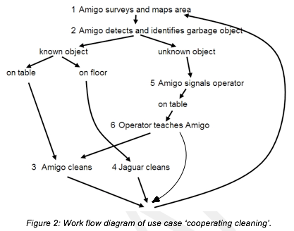
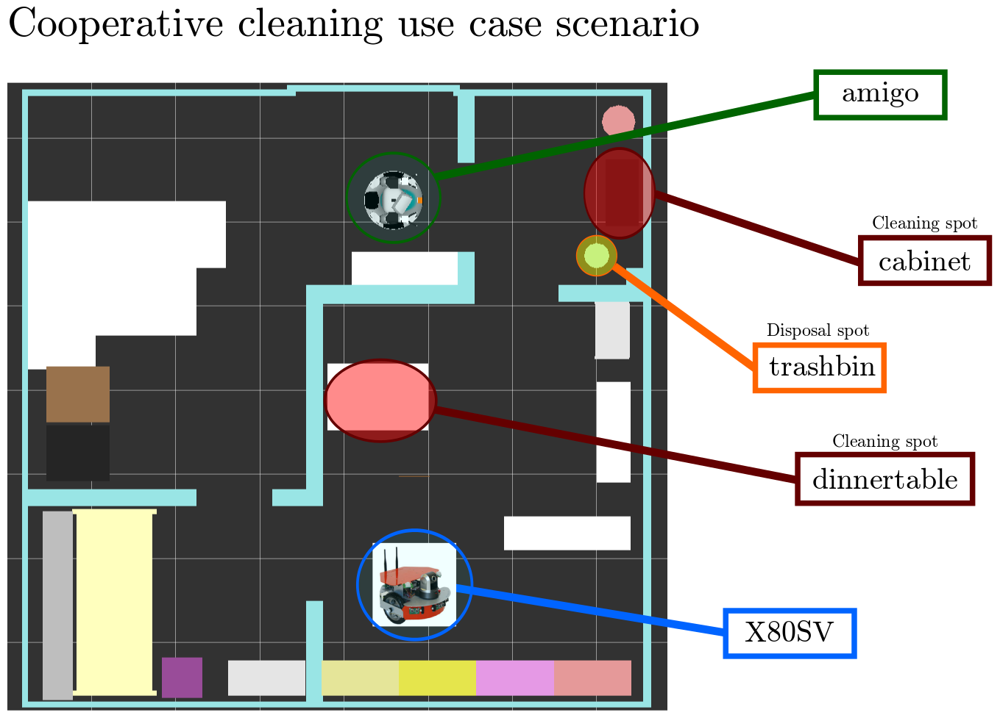

# r5cop_demo

Launch, configuration, executives files for the r5cop demonstrator of the x80sv (Saxion) and Amigo (TU/e) robot.

## Workflow diagram

## Scenario overview

## Additional 
1. Push object picture of unknown object to operator and ask whether the robot should clean the object or not 

## Flow
1. Map the environment using GUI (trash-bin, table1, table2, block1, block2) [prio]
2. Start cleanup task using GUI
3. Share world model with x80sv
4. See workflow diagram
5. Demo should be able to run for hours [prio] (robustness)
